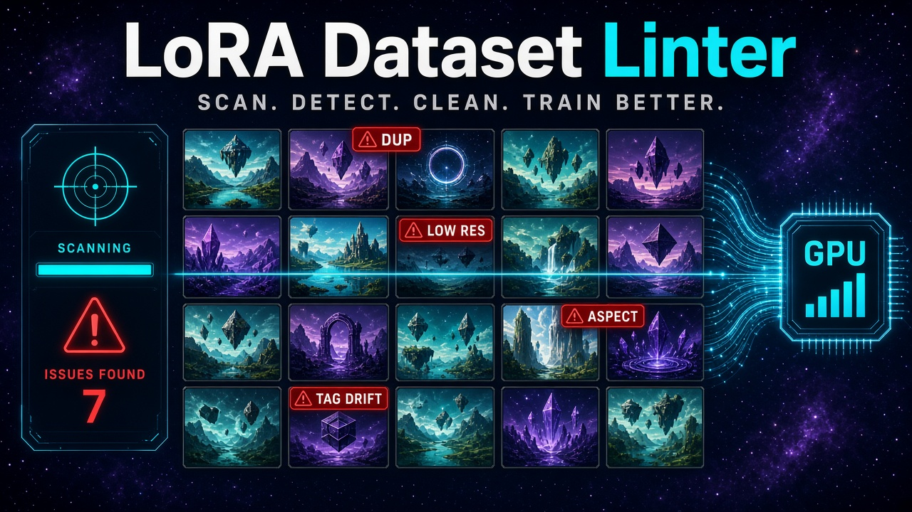

# LoRA Dataset Linter

Local, CPU-only check of an image folder before a ComfyUI or kohya-style LoRA training run. It looks for duplicates, resolution and aspect problems, unreadable files, and caption-tag drift so a bad set does not spend GPU time on a shared home PC.

The linter reads the dataset and writes reports beside it. It does not train, it does not open a GPU, and it does not talk to a ComfyUI server.

## Install

Python 3.11 or newer. Direct dependencies are pinned in `pyproject.toml` and `requirements.txt`.

```bash
python3 -m venv .venv
source .venv/bin/activate
pip install -r requirements.txt
pip install -e ".[dev]"
```

`pip install -e .` is enough if you only want the `lora-dataset-linter` command. The dev extra adds pytest and ruff.

CLIP near-duplicate search is off by default and is not installed with the package. To turn it on later, install a CPU build of PyTorch and `open-clip-torch` yourself, put a local checkpoint on disk, and set `duplicates.clip.enabled` plus `duplicates.clip.checkpoint` in the policy. The tool never downloads weights.

## Usage

```bash
lora-dataset-linter scan ./dataset
lora-dataset-linter scan ./dataset --output-dir ./lint-out --fix-plan ./lint-out/fix-plan.sh
lora-dataset-linter scan ./dataset --policy policy.yaml --trigger ohwx --min-side 768
lora-dataset-linter --version
```

`python -m loradatasetlinter scan ./dataset` is the same command.

| Flag | Effect |
|---|---|
| `--policy`, `-p` | YAML merged over the packaged defaults. Unknown keys are an error. |
| `--json` | Write the JSON report to this path. |
| `--html` | Write the self-contained HTML report to this path. |
| `--output-dir` | Write `report.json` and `report.html` here when those paths are omitted. |
| `--fix-plan` | Write a suggested move script. It is not executed. |
| `--min-side` | Override `resolution.min_side`. |
| `--hamming` | Override the perceptual-hash Hamming threshold. |
| `--hash-method` | `phash` or `dhash`. |
| `--base-resolution` | Use this single kohya bucket base (512, 768, or 1024 are the usual ones). |
| `--epochs`, `--batch-size` | Step estimate. |
| `--trigger` | Comma-separated words that should appear in every caption. |
| `--thumbnail-px` | HTML thumbnail max side. `0` skips thumbnails. |
| `--quiet`, `-q` | Skip the terminal summary. |

Exit codes: `0` pass, `1` warn, `2` fail, `3` error (bad policy, missing folder, or a report path that would land inside the dataset).

Reports must stay outside the dataset. `--json`, `--html`, `--fix-plan`, and `--output-dir` are refused when they resolve inside the folder being scanned. Their paths, existing file identities, and file/directory conflicts are preflighted together; reports are rendered and staged before any prior report is atomically replaced.

### Dataset layout

Images and same-name `.txt` captions sit together:

```text
dataset/
  10_subject/
    001.png
    001.txt
  1_style/
    a.jpg
    a.txt
  lone.png
  lone.txt
```

Image suffixes: `.jpg`, `.jpeg`, `.png`, `.webp`, `.bmp`, `.gif`, `.tif`, `.tiff`. A folder named `N_concept` (kohya repeats) contributes class `concept` with repeat count `N`. Anything else uses `stats.default_repeats` (1). Dotfiles, symlinks, and a `_linter_review` directory are skipped.

### Output

The terminal summary lists status, score, dataset stats, and findings. JSON is the same report without thumbnails. HTML is one file: inline CSS, inline filter script, and JPEG thumbnails as `data:` URIs generated with Pillow. Nothing in the report is fetched from the network.

`--fix-plan` writes a bash script that defaults to a dry run (`DRY_RUN=1`). Review it, then apply with `DRY_RUN=0 bash fix-plan.sh`. Moves go to `$DATASET/_linter_review/{duplicates,low_resolution,unreadable,orphans}/`. The lexicographically first path in an exact-duplicate group is kept. Each image/caption unit checks that sources and destinations remain contained in the dataset, refuses symlinks and pre-existing destinations, and preflights both files before either moves. A safe receipt journal is opened before the first move and records intent before each unit, supporting recovery if a later operation fails. An image's unshared caption moves beside it; shared captions are left in place and called out for review. Near-duplicates and missing captions are comments only.

## Checks

Every finding has a severity (`fail`, `warn`, or `info`), a reason, and the files involved.

**Duplicates.** SHA-256 of the file bytes (`exact_duplicate`), and SHA-256 of oriented RGB pixels when the files differ but the pixels do not (`exact_pixels`). Near-duplicates use pHash or dHash and a Hamming threshold (`near_duplicate`). Near-duplicate and optional CLIP results are connected similarity chains: each item has a qualifying link, but two members at opposite ends can be farther apart than the threshold. Optional CLIP cosine clusters (`clip_near_duplicate`) run only when the policy turns them on. A missing checkpoint or missing install becomes `clip_unavailable` and does not download anything.

**Resolution.** Shortest oriented side below `min_side` is `low_resolution`. Nearest-neighbor block constancy (factors 2 and 4) is `upscale_artifact`; flat images are ignored. A shortest side at or beyond `median/ratio` or `median*ratio` is `resolution_outlier` once the folder has enough images.

**Aspect and buckets.** Geometric-median aspect outliers (`aspect_outlier`) and extreme ratios (`extreme_aspect`). Each readable image is assigned a kohya-style bucket for every configured base resolution. Buckets keep about `base * base` pixels, both sides are multiples of 64, and the closest aspect wins (an exact bucket size wins when the image is already on the list). The report includes a histogram per base. A 2:1 image at base 512 does not become 1024×512; it becomes the closest area-matched bucket.

**Files.** Unreadable images (`corrupt_file`), CMYK (`cmyk`), non-opaque alpha (`alpha_channel`), fully opaque alpha (`opaque_alpha`), EXIF orientation other than 1 (`exif_orientation`), and more than one image format (`format_mix`). Oriented size is what resolution, aspect, buckets, and perceptual hashes use. The file itself is not rewritten.

**Captions.** Missing or empty captions, orphan `.txt` files, one caption shared by two images with the same stem, trigger words (whole tag or word boundary, case-insensitive), rare tags, low-support tags, near-synonyms (a small spelling map plus edit distance 1), inconsistent tag order, and mixed separators. Token length is a local estimate, not CLIP BPE. A caption over `max_tokens` (75) is `token_length`.

**Stats.** Image and caption counts, repeats × epochs step estimate (`ceil(weighted / batch_size) * epochs`), and class balance across subfolders (`class_imbalance`, `zero_repeats`). An empty folder is `empty_dataset`.

### Readiness score

The score starts at 100. Each finding subtracts its weight (fail 20, warn 6, info 1) and the result is clamped to 0–100.

Status is `fail` when any fail finding exists or the score is below `warn_min` (70). Otherwise it is `warn` when any warn finding exists or the score is below `pass_min` (90). Otherwise it is `pass`. A score equal to `pass_min` stays pass. A score equal to `warn_min` does not fail on the gate alone. Info findings change the score and do not, by themselves, change the status.

## Policy

Copy [`docs/policy.example.yaml`](docs/policy.example.yaml). It matches the packaged defaults. A user file is deep-merged: set only the keys you want to change. `version` must be `1`. Unknown keys are an error.

```yaml
version: 1
resolution:
  min_side: 768
captions:
  trigger_words: [ohwx]
  max_tokens: 75
duplicates:
  hamming_threshold: 6
score:
  pass_min: 90
  warn_min: 70
```

Disable a whole group with `enabled: false` under `resolution`, `aspect`, `duplicates`, `files`, `captions`, or `stats`.

## Development

```bash
python3 -m ruff check loradatasetlinter tests
python3 -m pytest
```

Tests build synthetic shapes and gradients in memory. The repository does not contain photographs, people, or adult images.

## Limitations

- Perceptual hashes catch resized, recompressed, and slightly edited copies. They are not a semantic "same subject" detector.
- CLIP embeddings are optional, CPU-only, and off by default. You supply a local checkpoint. There is no download and no GPU path.
- The token count is a word-and-punctuation estimate. It is not the CLIP tokenizer, so it will not match kohya's exact token total.
- The upscale hint only sees nearest-neighbor blocks of factor 2 or 4. Bicubic and AI upscales are not detected. JPEG compression can hide the block pattern. A hard vertical or horizontal split of constant color can look like a block upscale.
- Buckets follow kohya's area-preserving step grid (`make_bucket_resolutions` with scaling allowed). They are not every ComfyUI latent size, and `bucket_no_upscale` is not simulated.
- Repeat counts come from `N_name` folder names. A kohya `dataset.toml` is not read.
- EXIF orientation is reported and used for measurements. The file is not rotated or saved.
- Near-synonym detection is a short spelling list plus Levenshtein distance. It will miss some aliases and flag some unrelated tags.
- HTML thumbnails are previews composited on a dark background. Alpha and CMYK are not reproduced exactly.
- `--fix-plan` only writes a script. Dry run is the default. The linter never moves, renames, or deletes dataset files.
- Symlinks are skipped. Access time on a file can change when it is read. A report path inside the dataset is refused before any output directory is created.
